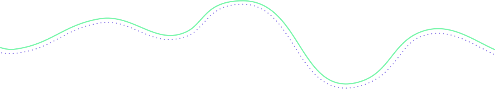

<!-- Header -->

<!-- region Introduce -->

<h2 id="greeting">

&nbsp;

</h2>

<dl id="introduce">
  
  <dt>&emsp;About Me</dt>
  <dd>&emsp;Software Engineer, Open Source Enthusiast and Amateur Ukulele Player. </dd>

  
  <dt>&emsp;Interests</dt>
  <dd>&emsp;Create, Code and Coffee.</dd>

  
  <dt>&emsp;Purpose</dt>
  <dd>&emsp;More simple, More pleasing.</dd>

  
  

  

  <b><em>Tech Stack</em></b>
  

   

  <table>

  <tr>
  <th>Web</th>
  <td>

  </td>
  </tr>

  <tr>
  <th>Framework</th>
  <td>

  </td>
  </tr>

  <tr>
  <th>Engine</th>
  <td>

  </td>
  </tr>

  <tr>
  <th>Misc</th>
  <td>

  </td>
  </tr>

  <tr>
  <th>IDE</th>
  <td>

  </td>
  </tr>

  </table>
  

  <small>&emsp;&nbsp;(Expand to view details)</small>
</dl>
<!-- endregion -->

<!-- region Article -->
<h2 id="article">

  &nbsp;Currently working on
</h2>

<!-- Article A -->

<!-- Article B -->

<!-- Article C -->

<!-- endregion -->

 

<!-- region Repository -->
<h2 id="repository">

</h2>

<!-- endregion -->

<!-- GIFs
  Coding Penguin: https://media.giphy.com/media/WIQ0N0OUvei1OW1h9Z/giphy.gif
  Yawning Cats: https://media.giphy.com/media/SAUC2JGsZvZMl6mq7D/giphy.gif
  Pretty Dog: https://media.giphy.com/media/6GjpHUATYwoTkN9x9w/giphy.gif
  Flower Corner: https://media.giphy.com/media/VEtksA8luiuSrzCjgm/giphy.gif
-->
