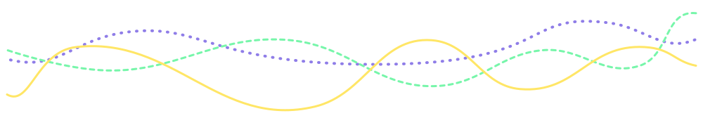
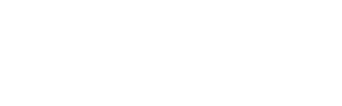
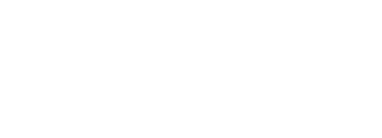
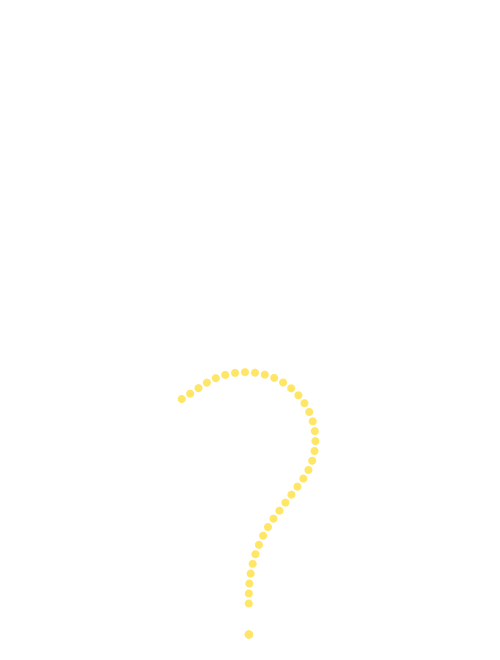
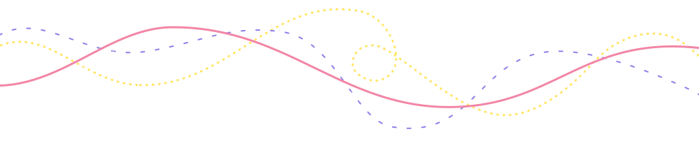

<!-- Header -->

<!-- region Introduce -->

<h2 id="greeting">
&nbsp;

</h2>

  
  
  

<dl id="introduce">
  
  <dt>&emsp;About Me</dt>
  <dd>&emsp;Software Engineer, Open Source Enthusiast and Amateur Ukulele Player. </dd>
  
  <dt>&emsp;Interests</dt>
  <dd>&emsp;<b>C</b>reate, <b>C</b>ode and <b>C</b>offee.</dd>
  
  <dt>&emsp;Purpose</dt>
  <dd>&emsp;<b>K</b>eep <b>I</b>t <b>S</b>imple, <b>S</b>tupid.</dd>
</dl>
<!-- endregion -->
<!-- region Tech Stack -->

  
  

    
<b><em>Tech Stack</em></b>

    <table>
      <tr>
        <th>Languages</th>
        <td></td>
      </tr>
      <tr>
        <th>Framework</th>
        <td></td>
      </tr>
      <tr>
        <th>Meta Framework</th>
        <td></td>
      </tr>
      <tr>
        <th>Cross-platform</th>
        <td></td>
      </tr>
      <tr>
        <th>Bundler</th>
        <td></td>
      </tr>
      <tr>
        <th>QC</th>
        <td></td>
      </tr>
      <tr>
        <th>PM</th>
        <td></td>
      </tr>
      <tr>
        <th>CI/CD</th>
        <td></td>
      </tr>
      <tr>
        <th>IDE</th>
        <td></td>
      </tr>
      <tr>
        <th>OS</th>
        <td></td>
      </tr>
    </table>
  

  <small>&emsp;&nbsp;(Expand to show details)</small>

<!-- endregion -->
<!-- region Activity -->

  
  

    
<b><em>Activity</em></b>

    <h2 id="article">Currently working on</h2>
    <!-- Article A -->
    
    

    <!-- Article B -->
    
    

    <!-- Article C -->
    
    

     
    <!-- region Repository -->
    <h2 id="repository">
      
    </h2>
    <h3>CLI</h3>
    
    
     
    
    
     
    
    
     
    
    <h3>Utility</h3>
    
    
     
    
    
     
    
    
    <h3>Misc</h3>
    
    
    <!-- endregion -->
  

  <small>&emsp;&nbsp;(Expand to show details)</small>

<!-- endregion -->
<!-- Footer -->

<!-- region Citation -->

[coding-penguin]: https://media.giphy.com/media/WIQ0N0OUvei1OW1h9Z/giphy.gif
[yawning-cats]: https://media.giphy.com/media/SAUC2JGsZvZMl6mq7D/giphy.gif
[pretty-dog]: https://media.giphy.com/media/6GjpHUATYwoTkN9x9w/giphy.gif
[flower-corner]: https://media.giphy.com/media/VEtksA8luiuSrzCjgm/giphy.gif

<!-- endregion -->
